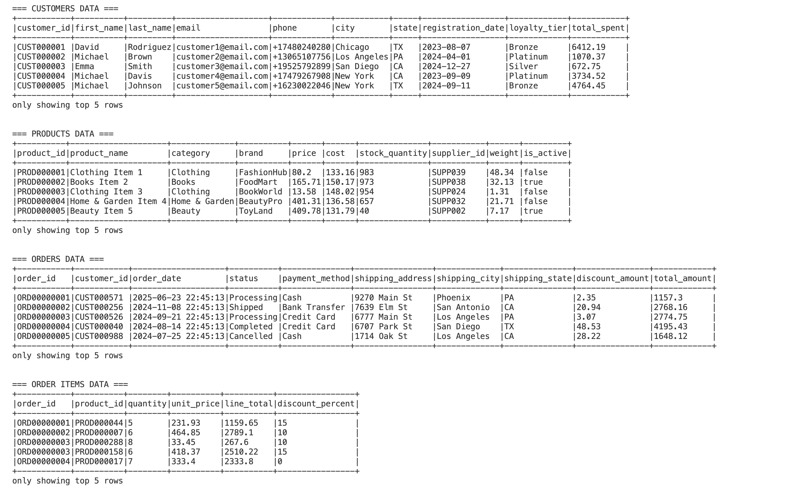
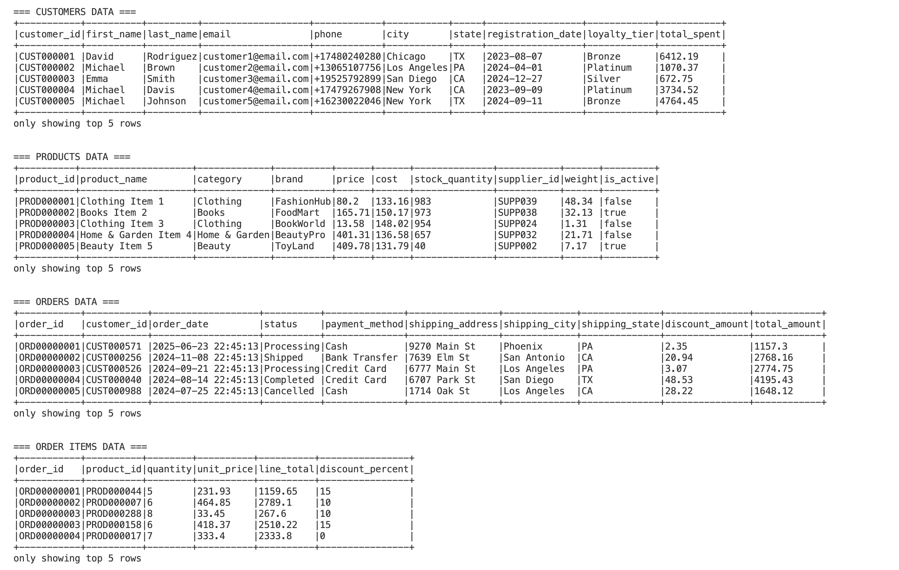
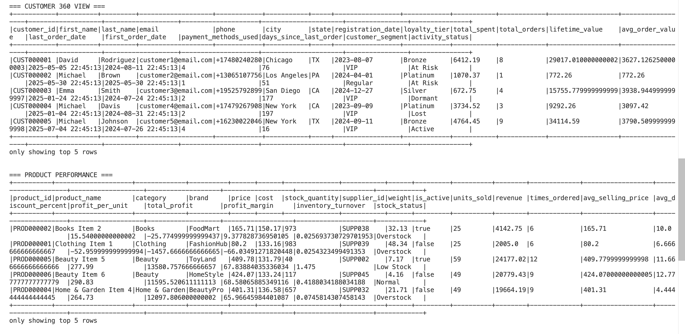

# 🛒 Spark Retail Analytics Pipeline

A comprehensive Apache Spark-based retail analytics pipeline that transforms raw e-commerce data into actionable business insights. This project demonstrates advanced PySpark capabilities including custom file writers, data quality frameworks, and business intelligence transformations.

## 📸 Sample Output

### Raw Data Display


### Order Items Data


### Transformed Analytics Data


## 🌟 Features

### 🔄 Data Processing
- **Smart Data Ingestion**: Loads CSV files with predefined schemas and validation
- **Comprehensive Quality Checks**: Null detection, duplicate identification, referential integrity
- **Advanced Transformations**: Customer 360 views, product performance analytics, sales summaries
- **Custom File Writers**: Overcomes Spark's default partition naming with meaningful filenames

### 📊 Business Analytics
- **Customer 360 View**: Lifetime value, purchase patterns, segmentation, activity status
- **Product Performance**: Sales metrics, profitability analysis, inventory turnover
- **Sales Summary**: Time-based aggregations with rolling averages
- **Customer Behavior**: Purchase preferences, favorite categories, payment methods

### 🎯 Key Capabilities
- ✅ Real-time dataframe visualization in terminal
- ✅ Multiple output formats (CSV, Parquet, JSON)
- ✅ Partitioned writes with custom naming
- ✅ Configurable logging and Spark settings
- ✅ Quality reporting and monitoring

## 🚀 Quick Start

### Prerequisites
```bash
# Install dependencies
pip install -r requirements.txt
```

### Run the Pipeline
```bash
# Basic execution with dataframe display
python main.py --show-samples

# Full pipeline with all options
python main.py \
    --input-path data/raw \
    --output-path data/output \
    --log-level INFO \
    --generate-reports \
    --show-samples

# Or use the convenience script
./run_pipeline.sh
```

### Generate Sample Data (Optional)
```bash
cd scripts
python generate_sample_data.py
```

## 📋 Sample Data Structure

### Raw Data Input
| Dataset | Records | Description |
|---------|---------|-------------|
| **Customers** | 1,000 | Customer profiles with loyalty tiers and spending |
| **Products** | 500 | Product catalog with pricing and inventory |
| **Orders** | 5,000 | Order transactions with shipping details |
| **Order Items** | 15,073 | Individual line items with quantities and discounts |

### Sample Customers Data
| customer_id | first_name | last_name | email | loyalty_tier | total_spent |
|-------------|------------|-----------|-------|--------------|-------------|
| CUST000001 | David | Rodriguez | customer1@email.com | Bronze | 6412.19 |
| CUST000002 | Michael | Brown | customer2@email.com | Platinum | 1070.37 |
| CUST000003 | Emma | Smith | customer3@email.com | Silver | 672.75 |

### Sample Products Data
| product_id | product_name | category | brand | price | stock_quantity |
|------------|--------------|----------|-------|-------|----------------|
| PROD000001 | Clothing Item 1 | Clothing | FashionHub | 80.2 | 983 |
| PROD000002 | Books Item 2 | Books | FoodMart | 165.71 | 973 |
| PROD000003 | Clothing Item 3 | Clothing | BookWorld | 13.58 | 954 |

## 📈 Analytics Output

### Customer 360 View
Comprehensive customer analytics including:
- **Lifetime Value**: Total projected customer worth
- **Purchase Patterns**: Order frequency and timing
- **Customer Segmentation**: VIP, Regular, New classifications
- **Activity Status**: Active, At Risk, Dormant, Lost

### Product Performance Analysis
- **Revenue Metrics**: Sales performance by product
- **Profitability Analysis**: Profit margins and unit economics
- **Inventory Insights**: Turnover rates and stock status
- **Sales Trends**: Performance over time

### Customer Behavior Insights
- **Purchase Preferences**: Favorite categories and brands
- **Payment Patterns**: Preferred payment methods
- **Discount Utilization**: Average discount usage
- **Cross-selling Opportunities**: Multi-category purchases

## 🏗️ Architecture

```
src/
├── ingestion/          # Data loading and schemas
├── transformation/     # Business logic transformations
├── quality/           # Data quality framework
├── output/            # Custom file writers
└── utils/             # Spark utilities and configuration
```

### Key Components

#### Custom File Writers
Solves Spark's default partition naming limitations:
- **Single Files**: `customer_360_view_analysis.csv`
- **Timestamped Files**: `product_performance_20250720_013716.csv`
- **Partitioned Files**: `sales_summary_year_2024_month_10.csv`

#### Data Quality Framework
- Automated null value detection
- Duplicate record identification
- Referential integrity validation
- Quality reporting and metrics

## 🔧 Configuration

### Command Line Options
```bash
--input-path       # Input data directory (default: data/raw)
--output-path      # Output directory (default: data/output)
--log-level        # Logging level (DEBUG, INFO, WARNING, ERROR)
--generate-reports # Generate data quality reports
--show-samples     # Display sample dataframes in terminal
```

### Spark Configuration
Located in `config/spark_config.json`:
```json
{
    "spark.sql.adaptive.enabled": "true",
    "spark.sql.adaptive.coalescePartitions.enabled": "true",
    "spark.serializer": "org.apache.spark.serializer.KryoSerializer"
}
```

## 📊 Output Files

The pipeline generates several output files in `data/output/`:

| File | Format | Description |
|------|--------|-------------|
| `customer_360_view_analysis.csv` | CSV | Complete customer analytics |
| `product_performance_YYYYMMDD_HHMMSS.csv` | CSV | Product sales metrics |
| `customer_behavior_analysis.parquet` | Parquet | Customer behavior patterns |
| `sales_summary_partitioned/` | Partitioned CSV | Sales data by year/month |

## 🧪 Interactive Data Exploration

### Option 1: Interactive Python Script
```bash
python interactive_data_viewer.py
```
Menu-driven interface with filtering, sorting, and SQL capabilities.

### Option 2: Jupyter Notebook
```bash
jupyter notebook explore_data.ipynb
```
Interactive notebook with visualizations and analysis examples.

### Option 3: PySpark Shell
```bash
pyspark
# Follow the guide in pyspark_shell_guide.md
```

## 🛠️ Development

### Dependencies
- **PySpark 3.5.0**: Distributed data processing
- **Pandas 2.0.3**: Data manipulation and analysis
- **PyArrow 12.0.1**: Columnar data format support
- **NumPy 1.24.3**: Numerical computing
- **PyYAML 6.0**: Configuration file parsing

### Project Structure
```
spark-retail-analytics/
├── main.py                    # Main pipeline orchestration
├── requirements.txt           # Python dependencies
├── run_pipeline.sh           # Convenience script
├── config/                   # Configuration files
├── data/                     # Data directories
│   ├── raw/                 # Input data
│   ├── output/              # Generated analytics
│   └── processed/           # Intermediate data
├── src/                     # Source code
├── scripts/                 # Utility scripts
├── docs/                    # Documentation and screenshots
└── tests/                   # Test files
```

## 🎯 Use Cases

### Retail Companies
- **Customer Analytics**: Understand customer behavior and lifetime value
- **Inventory Management**: Optimize stock levels and identify slow movers
- **Sales Performance**: Track revenue trends and product performance
- **Marketing Insights**: Segment customers for targeted campaigns

### Data Engineers
- **Spark Best Practices**: Custom file writers and quality frameworks
- **Pipeline Architecture**: Modular, scalable data processing
- **Performance Optimization**: Adaptive query execution and partitioning
- **Data Quality**: Comprehensive validation and monitoring

## 🤝 Contributing

1. Fork the repository
2. Create a feature branch (`git checkout -b feature/amazing-feature`)
3. Commit your changes (`git commit -m 'Add amazing feature'`)
4. Push to the branch (`git push origin feature/amazing-feature`)
5. Open a Pull Request

## 📄 License

This project is licensed under the MIT License - see the [LICENSE](LICENSE) file for details.

## 🙏 Acknowledgments

- Apache Spark community for the excellent framework
- Retail analytics best practices and industry standards
- Open source data processing ecosystem

---

**Built with ❤️ using Apache Spark and Python**